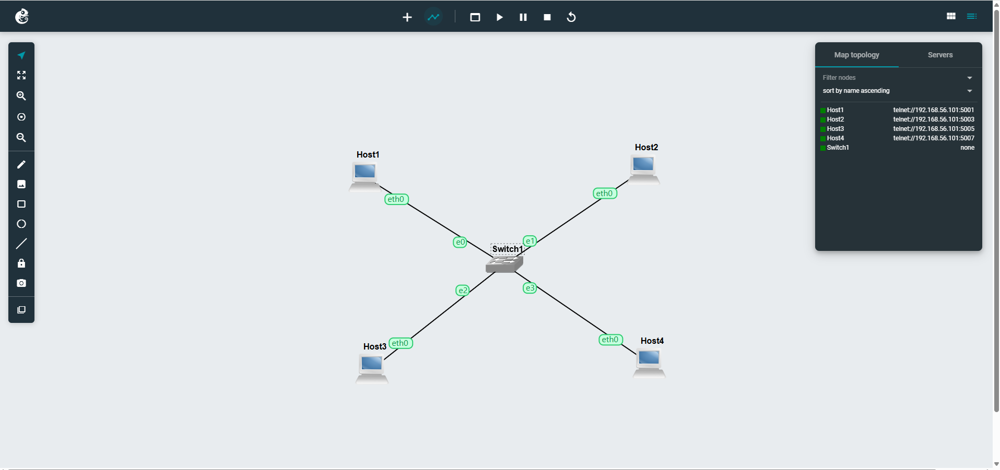
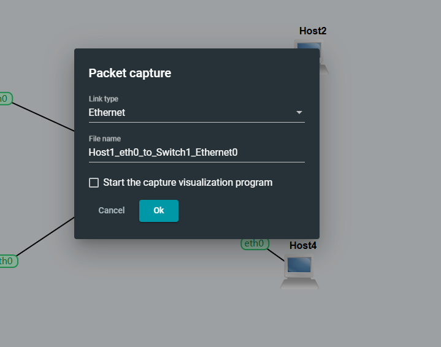
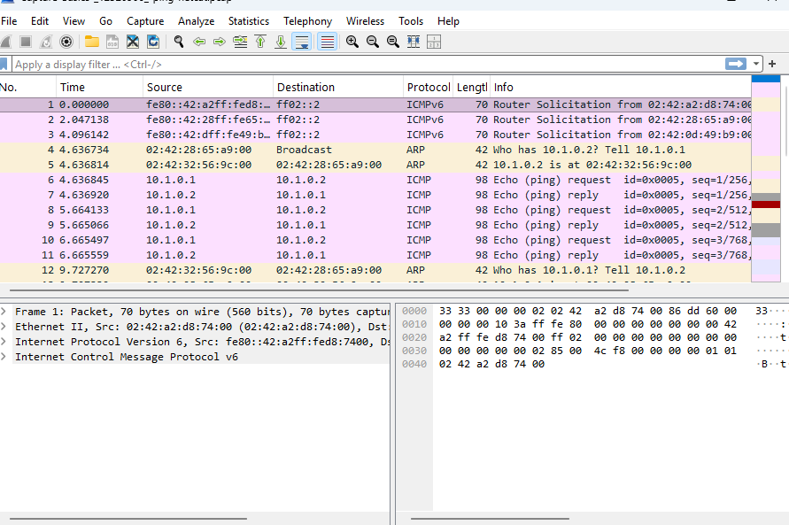

# Week 3 – Netcat Communication and Packet Capture

## Overview

The Week 3 practical focuses on evaluating communication between network devices at both the network and application layers. The activities were place on the existing GNS3 LAN, which consisted of four Linux hosts and one Ethernet switch.

The primary activities achieved during this practical were:
- Ping is used to test network connection between hosts
- For basic client-server communication, use Netcat (nc)
- Sending text messages between two Linux hosts
- Starting a packet capture via a GNS3 network link
- ICMP and application traffic were generated while the capture was ongoing
- Wireshark is used to inspect the collected traffic

## Network Topology

The network was made up of four Linux machines connected by a single Ethernet switch.

Figure 1: Week 3 GNS3 network topology containing Host1, Host2, Host3, Host4 and Switch1

All four hosts connected to the Ethernet switch via their eth0 ports. The green lights indicate that the hosts and network connections were active.

The hosts utilised IP addresses from the 10.1.0.0/24 network.

## Connectivity Testing

Before testing application connectivity, I made sure the hosts could interact with one another using the ping command.

### Ping from Host1 to Host2

The following command was executed:

ping -c 3 10.1.0.2

Figure 2: Successful ICMP connectivity test from Host1 to Host2

The results showed:

There were 3 packets broadcast and 3 packets received, with 0% loss.

The average round-trip time was about:

0.222 ms

This proved that Host2 was accessible from Host 1.

### Testing Host2 Again

Another connection test to Host2 was carried out using:

ping -c 3 10.1.0.2

Figure 3: Three successful ICMP Echo Requests and Replies between Host1 and Host2

All three packets were successfully received, with 0% packet loss.

### Ping from Host1 to Host3

Connectivity to Host3 was checked using:

ping -c 3 10.1.0.3

Figure 4: Successful ping test from Host1 to Host3

The results showed:

There were 3 packets broadcast and 3 packets received, with 0% loss.

This validated the effective connectivity between Host1 and Host3.

### Ping from Host1 to Host4

Host4 was also evaluated using:

ping -c 3 10.1.0.4

Figure 5: Successful connectivity test between Host1 and Host4

The test again yielded:

There were 3 packets broadcast and 3 packets received, with 0% loss.

These tests proved that all hosts were accessible via the LAN.

## Task 1 – Simple Application Communication Using Netcat

### What is Netcat?

Netcat is a basic networking program that allows two devices to communicate using the client-server approach.

Unlike ping, which employs ICMP at the network layer, Netcat may interact via transport and application-level connections. This makes Netcat useful for determining if programs can communicate across a network.

### Starting the Netcat Server

One Linux machine was setup to serve as the Netcat server.

The command given was:

nc -l -p 12345

The following choices were used:
- nc - Starts Netcat
- -l switches Netcat into listening/server mode
- -p 12345 specifies the listening port

The server stayed open while waiting for another host to make a connection.

Figure 6: Netcat server listening for a connection and receiving a message

### Connecting the Netcat Client

The Netcat client ran on another Linux host.

The client connects to the server with:

nc 10.1.0.1 12345

Here:
- The IP address for the Netcat server is 10.1.0.1
- 12345 is the TCP port used for this connection

After the connection was established, text messages could be transmitted between the two hosts.

Figure 7: Netcat client connected to the server at 10.1.0.1

Text message with the name:

Sumnima Dhungel.

was transmitted via the Netcat connection.

This indicated that the two Linux hosts communicated successfully at the application level.

### Sending Information Between Client and Server

Netcat supports two-way communication. As a result, information input on one host can be shown on another as long as the connection is operational.

The screenshots show the exchange of text, including the student identity information.

Figure 8: Netcat session showing communication between the client and server

This proved that the two devices could interact not just using ICMP and ping, but also using an application on a specified TCP port.

## Task 2 – Capturing Network Packets

The second goal was to capture packets sent between Host1 and the Ethernet switch.

### Starting the Packet Capture

Packet capture began by selecting the link between Host1 and Switch1 in GNS3 and selecting the packet capture option.

The link type was set as follows:

Ethernet

A capture file was produced for the traffic that passed across the specified connection.

Figure 9: Starting an Ethernet packet capture on the link between Host1 and Switch1

After the capture began, network traffic was created with commands like ping and Netcat.

### ICMP Traffic During the Capture

For instance, three ping requests were sent using:

ping -c 3 10.1.0.2

This resulted in Host1 sending ICMP Echo Request packets to Host2 and receiving ICMP Echo Reply packets.

Because the capture was operating on the link between Host1 and the switch, these packets could be captured.

### Viewing the Capture in Wireshark

The collected traffic was opened in Wireshark.

Figure 10: Captured network traffic displayed in Wireshark

Wireshark captured numerous forms of communications, including:
- ARP packets
- ICMP echo requests
- ICMP Echo Replies
- IPv6 Router Solicitation traffic

For example, Wireshark observed communication between:

10.1.0.1

and:

10.1.0.2

The ICMP packets contained both:

Echo (ping) request

and:

Echo (ping) reply

This gave packet-level confirmation that the two hosts were communicating effectively.

### ARP Traffic

The capture also included ARP traffic like as:

Who has 10.1.0.2? Tell 10.1.0.1.

This illustrated how Host1 utilised the Address Resolution Protocol (ARP) to discover the MAC address associated with the target IPv4 address prior to connecting with it.

## Commands Used

The primary commands utilised in this practical were:

ping -c 3 10.1.0.2

Connectivity to Host2 is tested by sending three ICMP queries.

ping -c 3 10.1.0.3

Tests the connection to Host3.

ping -c 3 10.1.0.4

Tests the connection to Host4.

nc -l -p 12345

Starts Netcat in server/listen mode.

nc 10.1.0.1 12345

Launches Netcat as a client and connects to the server at 10.1.0.1.

## Ping vs Netcat

This practical highlighted a significant gap between ping and Netcat.

| Tool | Main Purpose |	Communication |
| ---- | ------------ | ------------- |
| ping |	Test basic network reachability and delay	| ICMP |
| Netcat (nc) |	Test application communication between hosts |	TCP/UDP |

A successful ping proves that fundamental IP communication is operating, but a successful Netcat connection shows that communication may take place over a specific application port.

Using both programs gives additional information for evaluating or troubleshooting network connectivity.

## What I Learned

During the Week 3 practical, I learnt how:
- Validate communication across several Linux hosts
- Ping is a network-layer connection testing tool
- Interpret the packet loss and round-trip time
- Understand the distinction between ICMP and application communication
- Use Netcat as a basic server
- Use Netcat as the client
- Connect two Linux hosts using their IP addresses and port numbers
- Send text messages to network hosts
- Understand the significance of TCP/UDP port numbers
- Begin and terminate packet captures in GNS3
- Capture traffic that passes across a certain network link
- Open network capture files using Wireshark
- Identify ARP and ICMP packets with Wireshark
- Identify the ICMP Echo Request and Echo Reply packets
- Learn how packet capture may help with network troubleshooting and analysis

## Conclusion

The Week 3 practical offered hands-on experience with application communication and packet capture. The four Linux hosts were successfully linked via Ethernet switch, and ICMP connection tests revealed 0% packet loss between the tested devices.

Netcat was then used to establish client-server connection and send text between Linux machines. This highlighted the distinction between fundamental network reachability with ping and application-level communication with Netcat.

Finally, packet capture was carried out on the connection between Host1 and Switch1. Wireshark was used to inspect the collected traffic, which included ARP and ICMP packets. This exercise gave an excellent introduction to packet-level network analysis and demonstrated how GNS3 and Wireshark can operate together for network testing and troubleshooting.

Link to week3.md file: https://github.com/Sumnima-12322151/12322151-COIT20261/blob/main/week3.md
