# Week 4 – HTTP Clients, Multi-Subnet Routing and Packet Capture

## Overview

The Week 4 practical concentrated on HTTP client-server communication over different routed networks. A GNS3 architecture was established, with three subnets linked by two Linux routers.

The practical introduces:
- Multi-subnet IPv4 communication
- Router interface setup
- Routing tables and Default gateways
- Connectivity testing using ping
- A Firefox-based graphical HTTP client and VNC connection to a graphical GNS3 host
- Use GNS3 to collect packets and Wireshark for examination
- HTTP transmission using TCP port 80
- Command-line HTTP clients, such as wget and curl

## Task 1 – HTTP Client with GUI

### Network Topology

The GNS3 topology consisted of:
- Host1 – Firefox HTTP client
- Switch1
- Router1
- Switch2
- Router2
- Switch3
- Server1 – HTTP server

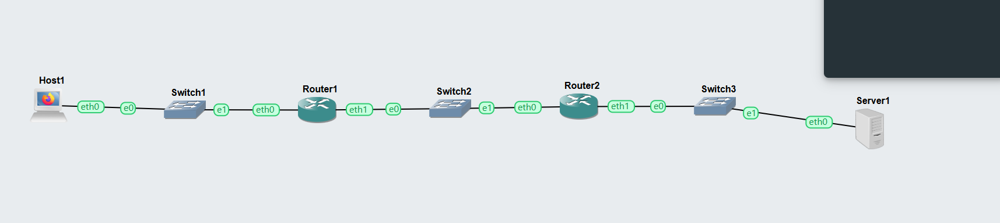

Figure 1: GNS3 topology used for the Week 4 HTTP client activity

The logical communication pathway was:

Host1 → Switch1 → Router1 → Switch2 → Router2 → Switch3 → Server1

The topology was built such that the HTTP client and server were on separate networks. As a result, traffic between them had to go via both Routers 1 and 2.

### IPv4 Network Structure

The router setup depicted in the screenshots utilised three IPv4 networks:

| Subnet   | IPv4 Network    | Purpose                             |
| -------- | --------------- | ----------------------------------- |
| Subnet A | 192.168.10.0/24 | Client-side network                 |
| Subnet B | 192.168.20.0/24 | Network between Router1 and Router2 |
| Subnet C | 192.168.30.0/24 | Server-side network                 |

The major addresses recorded in the configuration were:

| Device  | Interface | IPv4 Address     |
| ------- | --------- | ---------------- |
| Host1   | eth0      | 192.168.10.10/24 |
| Router1 | eth0      | 192.168.10.1/24  |
| Router1 | eth1      | 192.168.20.1/24  |
| Router2 | eth0      | 192.168.20.2/24  |
| Router2 | eth1      | 192.168.30.1/24  |
| Host2   | eth0      | 192.168.30.10/24 |

## Router1 Configuration

The command:

ip addr

was used to verify the interfaces set on Router1.

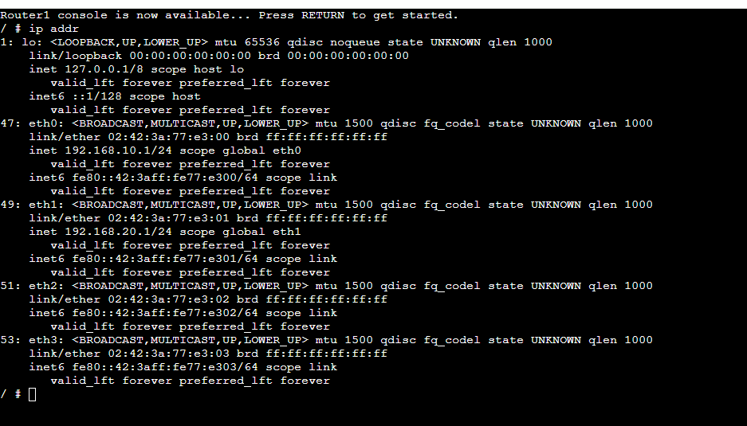

Figure 2: IPv4 configuration of Router1

Router1 has two active IPv4 interfaces:

eth0: 192.168.10.1/24
eth1: 192.168.20.1/24

This enabled Router1 to link the client-side network to the intermediate network.

### Router1 Routing Table

The following command was executed:

ip route

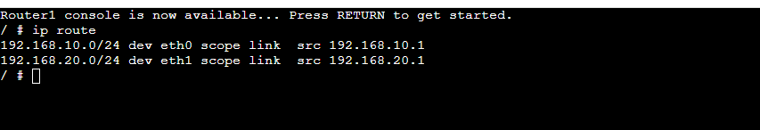

Figure 3: Routing table of Router1

The result displayed two directly linked networks:

192.168.10.0/24 dev eth0 scope link src 192.168.10.1
192.168.20.0/24 dev eth1 scope link src 192.168.20.1

This meant that Router1 could immediately connect to Subnet A and Subnet B via their respective interfaces.

## Router2 Configuration

The routing table of Router 2 was examined using:

ip route

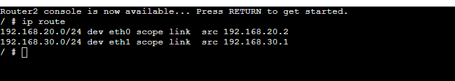

Figure 4: Routing table of Router2

The directly related networks were:

192.168.20.0/24 dev eth0 scope link src 192.168.20.2
192.168.30.0/24 dev eth1 scope link src 192.168.30.1

As a result, Router2 linked Subnet B to Subnet C on the server side.

### Router2 Interface Addresses

The command:

ip addr

was also utilised to validate the Router2 interfaces.

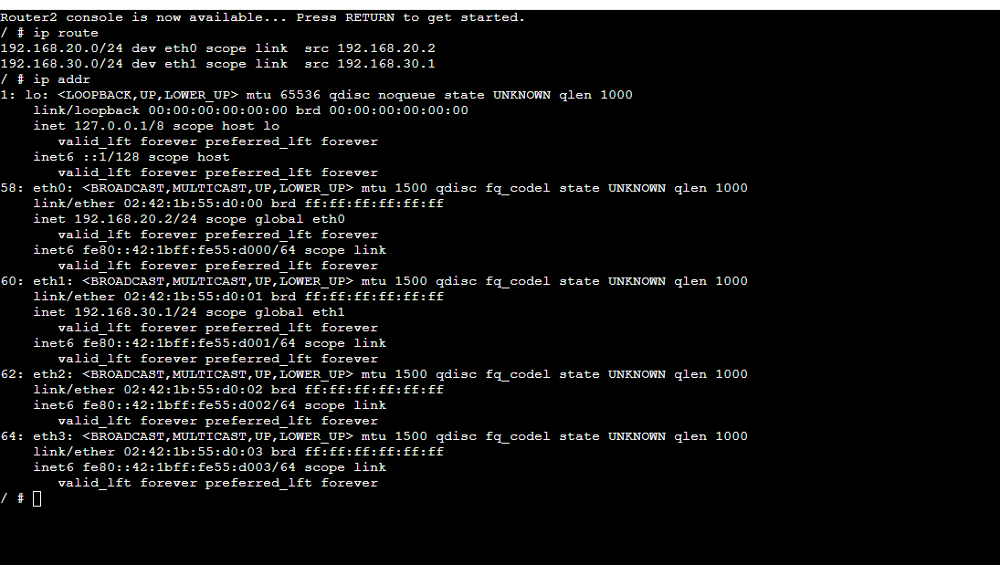

Figure 5: IPv4 interfaces configured on Router2

Important addresses were:

eth0: 192.168.20.2/24
eth1: 192.168.30.1/24

Routers 1 and 2 supplied the path for packets to transit between the HTTP client and the server.

## Host Configuration and Default Gateway

The end host on Subnet C was setup as follows:

192.168.30.10/24

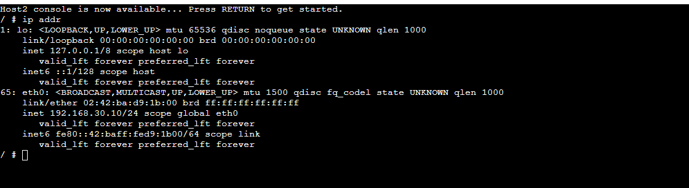

Figure 6: IPv4 configuration of the host on Subnet C

The routing table was verified using:

ip route

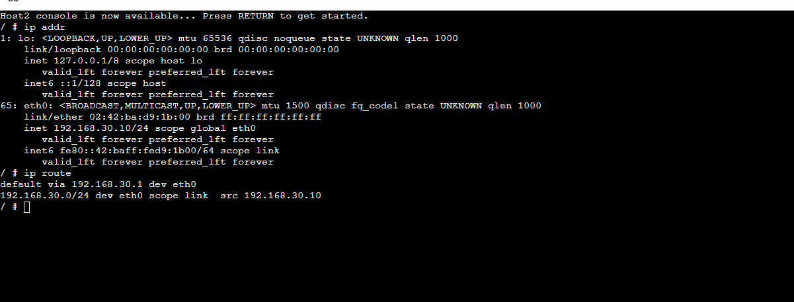

Figure 7: Host routing table showing its default gateway

The output contained:

default via 192.168.30.1 dev eth0
192.168.30.0/24 dev eth0 scope link src 192.168.30.10

The address:

192.168.30.1

was Router2's interface on the same subnet, and hence served as the default gateway.

When a host wants to interact with a target outside of its local subnet, it uses the default gateway.

## Testing Connectivity Between Routers

Prior to trying HTTP connection, Router1 and Router2's connectivity was checked.

The command used by Router1 was:

ping -c 5 192.168.20.2

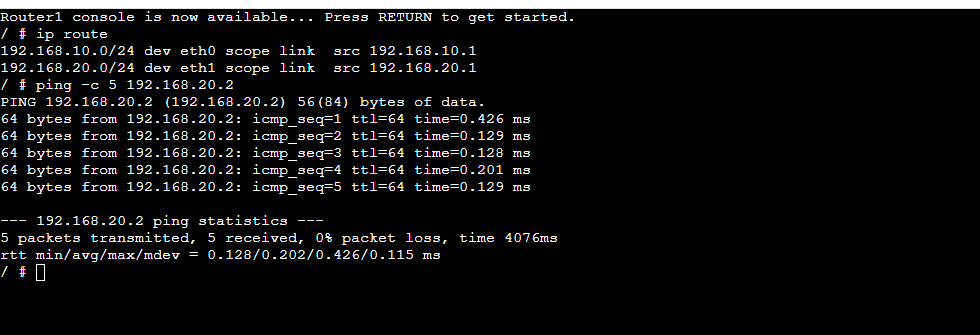

Figure 8: Successful connectivity test between Router1 and Router2

The results showed:

There were 5 packets broadcast and 5 packets received with 0% loss.

This demonstrated that the two routers could properly interact across Subnet B.

## Server Interface Verification

The server interface was tested with:

ip addr

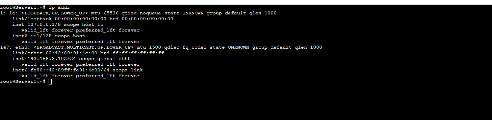

Figure 9: Server1 network interface information

Checking the server address was critical since the HTTP client had to use the proper server IP address when requesting the webpage.

## Accessing the Firefox Client through VNC

Host1 ran a graphical Firefox environment and was accessible using the GNS3 VNC/noVNC interface.

Within Host1, a terminal was opened and the network setup was examined using:

ip addr

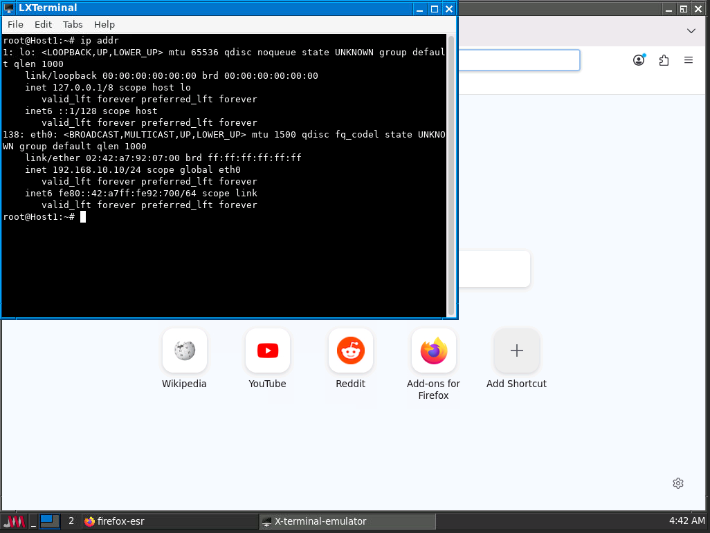

Figure 10: Firefox Host1 accessed through the graphical environment

The screenshot displayed:

192.168.10.10/24

on the eth0 interface.

This put Host1 on Subnet A.

Firefox represented the HTTP client, while Server1 represented the HTTP server.

## HTTP Client-Server Communication

The GUI task called for Firefox to submit an HTTP request from Host1 to the server.

Conceptually, the traffic took this route:

Host1
   ↓
Switch1
   ↓
Router1
   ↓
Switch2
   ↓
Router2
   ↓
Switch3
   ↓
Server1

When an unencrypted http:// URL is reached, HTTP defaults to TCP port 80.

Because Host1 and Server1 were on different networks, both routing and proper gateway setup were necessary for the HTTP session to succeed.

## Packet Capture and Wireshark Analysis

Packet capture was carried out in GNS3, and the resulting.pcap files were examined in Wireshark.

### First Packet Capture

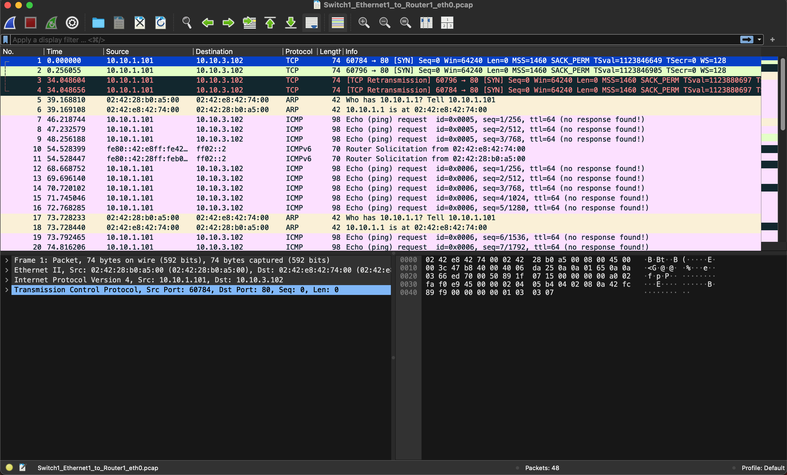

Figure 11: Wireshark capture showing TCP, ARP and ICMP traffic

The capture contained TCP packets from:

10.10.1.101

to:

10.10.3.102

Using Destination Port:

80

For example, Wireshark showed:

60784 → 80 [SYN]

This is a TCP SYN packet, which indicates the client's attempt to establish a TCP connection with the web server on port 80.

The capture also included:

TCP Retransmission entries.

A retransmission happens when the sender does not get the expected acknowledgement within the specified timeframe and hence transmits the packet again.

This sample showed multiple SYN packets. This indicated that the client was attempting to create an HTTP TCP connection, but no successful TCP handshake was displayed in this snapshot.

### ARP Traffic

The same capture included ARP traffic like as:

Who has 10.10.1.1? Tell 10.10.1.101

followed by a response with the MAC address associated with 10.10.1.1.

On an Ethernet LAN, ARP is used to map an IPv4 address to a MAC address before delivering the Ethernet frame locally.

### ICMP Traffic

The Wireshark clip included ICMP Echo Request packets between:

10.10.1.101

and:

10.10.3.102

Several parcels were marked.

Echo (ping) request

This indicated that ICMP was also utilised to test connection between the devices.

## Second Packet Capture

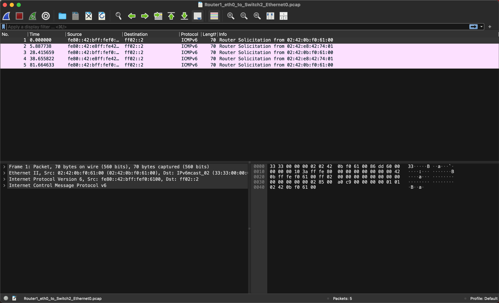

Figure 12: Additional Wireshark packet capture

This sample showed ICMPv6 Router Solicitation packets.

Router Solicitation messages are part of IPv6 Neighbour Discovery and allow IPv6 hosts to seek information from IPv6 routers.

This demonstrated that packet captures may include background protocol traffic in addition to IPv4 and HTTP traffic created explicitly for an investigation.

## Understanding the Protocols Observed

| Protocol | Purpose Observed in the Practical                           |
| -------- | ----------------------------------------------------------- |
| ARP      | Resolves IPv4 addresses to Ethernet MAC addresses           |
| ICMP     | Tests IPv4 connectivity using ping                          |
| TCP      | Provides reliable transport for HTTP                        |
| HTTP     | Application protocol used between web client and web server |
| ICMPv6   | Supports IPv6 control and neighbour/router discovery        |

The packet capture helps to relate the theoretical protocol layers to the network's real packets.

## Task 2 – HTTP Client with Command Line Interface

The Week 4 instruction presented two command-line HTTP clients:

wget

and:

curl

These programs allow you to conduct HTTP activities without using a graphical web browser.

### wget

You may request a website by using:

wget: http://<server-ip>

wget generally downloads and saves the requested material to a local file.

For example:

The command wget http://<server-ip>/index.html retrieves the server's index.html page.

### curl

A webpage can also be visited via:

curl http://<server-ip>

Curl generally prints the server response straight to the terminal.

It may also store the response into a file:

curl -o page.html http://<server-ip>/page.html.

## GUI HTTP Client vs CLI HTTP Clients

| Feature                     | Firefox   | wget         | curl         |
| --------------------------- | --------- | ------------ | ------------ |
| User interface              | Graphical | Command line | Command line |
| Displays a webpage visually | Yes       | No           | No           |
| Downloads resources         | Yes       | Yes          | Yes          |
| Suitable for scripting      | Limited   | Yes          | Yes          |
| Resource usage              | Higher    | Lower        | Lower        |
| Useful for automation       | Limited   | Yes          | Yes          |
| Useful for HTTP testing     | Yes       | Yes          | Yes          |

Firefox is beneficial when a user has to engage graphically with a website, but wget and curl are very handy for testing, scripting, and network automation.

## Important Commands Used

### View IP configuration

ip addr

Used to show the IPv4 and IPv6 addresses assigned to network interfaces.

### View routing table

ip route

Used to inspect routes and default gateways.

### Test connectivity

ping -c 5 192.168.20.2

Used to test Router1 and Router2 connection.

### Download a webpage with wget

wget http://<server-ip>/ is a command for downloading webpages without a graphical browser.

### Access a webpage with curl

curl http://<server-ip>

Used to send an HTTP request and show the result.

## What I Learned

During the Week 4 practical, I learnt how:
- Make a multi-subnet network in GNS3
- Connect three IPv4 networks with two routers
- Configure router interfaces using addresses from several networks
- Configure the default gateways for the end hosts
- Examine interface information with ip addr
- Examine the Linux routing tables with ip route
- Use ICMP and ping to test connectivity
- Understand how routers route packets between networks
- VNC provides access to a graphical Firefox host
- Understand the functions of an HTTP client and server
- Understand that HTTP typically uses TCP port 80
- Capture network packets using GNS3
- Open.pcap files using Wireshark
- Recognise TCP SYN packets
- Understand the fundamental objective of the TCP connection setup procedure
- Recognise TCP retransmissions
- Identify ARP traffic with Wireshark
- Identify ICMP Echo Request packets
- Identify ICMPv6 Router Solicitation Packets
- Understand that captures may include both purposely created and background traffic
- Understand why wget and curl are command-line HTTP clients
- Understand why command-line networking tools are important for testing and automation

## Conclusion

The Week 4 exercise gave hands-on experience with HTTP communication, multi-subnet routing, and packet analysis.

Using two routers, we constructed a network with three IPv4 subnets. Router interface addresses and routing tables were checked, and connection between Routers 1 and 2 was successfully tested with no packet loss.

Host1 was a Firefox-based HTTP client that could be accessed via a graphical environment. Server1 represented the HTTP server on the remote side of the routed topology.

The packet captures were then inspected with Wireshark. The captures included numerous network protocols, such as ARP, ICMP, TCP, and ICMPv6. TCP SYN packets sent to port 80 displayed an attempt to connect to an HTTP server, but TCP retransmissions showed what happens when the expected response is not obtained.

Overall, the exercise increased my knowledge of IPv4 routing, HTTP client-server communication, TCP, packet captures, Wireshark, VNC, and command-line networking tools.

Link to week4.md file: https://github.com/Sumnima-12322151/12322151-COIT20261/blob/main/week4.md
