# Week 5 – Routing Tables, IP Forwarding and Dynamic Routing with OSPF

## Overview

The Week 5 practical focused on learning how routers forward packets between IP networks and how routing information is stored.

The practical was divided into two major tasks.
- View routing tables and enable IP forwarding
- Configure dynamic routing using OSPF and FRRouting (FRR)

During the activities, I created numerous subnets, allocated static IPv4 addresses, set default gateways, enabled packet forwarding on a Linux router, reviewed routing tables, tested connectivity with ping, and analysed dynamic routing behaviour using traceroute and OSPF.

## Task 1 – Viewing Routing Tables and IP Forwarding

### Network Topology

For the first task, I developed a network that includes:

Host1, Host2, Host3, Router1, and Switch1

Hosts 1 and 2 were linked to the Ethernet switch. The switch connected to Router1 via eth0, but Host3 connected directly to Router1 via eth1.

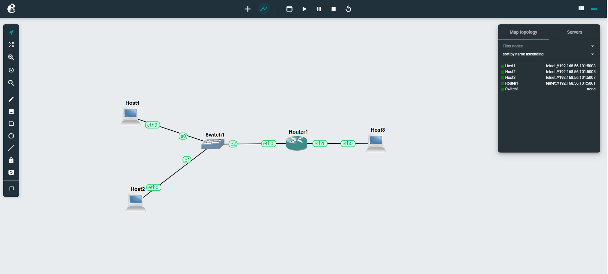

Figure 1: GNS3 topology consisting of three Linux hosts, one Ethernet switch, and one Linux router

This topology resulted in two independent IPv4 subnets linked by Router1.

### IPv4 Addressing Scheme

The initial subnet used:

10.1.1.0/24

The second subnet used:

10.1.2.0/24

The address configuration was:

| Device  | Interface | IPv4 Address | Purpose                        |
| ------- | --------- | ------------ | ------------------------------ |
| Router1 | eth0      | 10.1.1.1/24  | Gateway for subnet 10.1.1.0/24 |
| Host1   | eth0      | 10.1.1.2/24  | Host on first subnet           |
| Host2   | eth0      | 10.1.1.3/24  | Host on first subnet           |
| Router1 | eth1      | 10.1.2.1/24  | Gateway for subnet 10.1.2.0/24 |
| Host3   | eth0      | 10.1.2.2/24  | Host on second subnet          |

### Configuring Host1

Host1 was setup using a static IP address.

10.1.1.2

The Subnet Mask was:

255.255.255.0

The default gateway was set as follows:

10.1.1.1

The setup utilised was:

auto eth0
iface eth0 inet static 
address 10.1.1.2
netmask 255.255.255.0
gateway 10.1.1.1

up sysctl net.ipv4.ip_forward=0

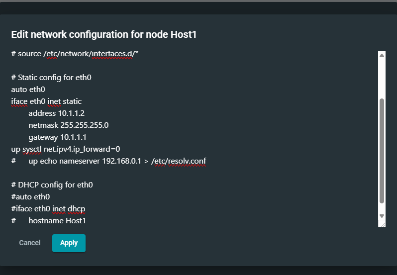

Figure 2: Static IPv4 configuration for Host1

IP forwarding was turned off because Host1 was behaving as an end host rather than a router.

### Configuring Host2

Host 2 was configured with:

IP address: 10.1.1.3 
Subnet mask: 255.255.255.0
Gateway: 10.1.1.1

The configuration was:

auto eth0
iface eth0 inet static
address 10.1.1.3
netmask 255.255.255.0
gateway 10.1.1.1

up sysctl net.ipv4.ip_forward=0

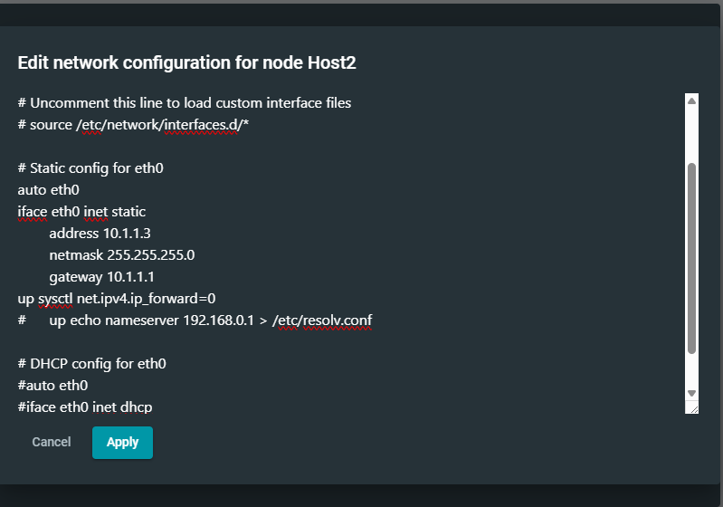

Figure 3: Static IPv4 configuration for Host2

### Configuring Router1

Router 1 joined the two distinct IPv4 networks.

The first interface, eth0, was setup as follows.

auto eth0 
iface eth0 inet static 
address 10.1.1.1 
netmask 255.255.255.0

IP forwarding was enabled with:

up sysctl net.ipv4.ip_forward=1

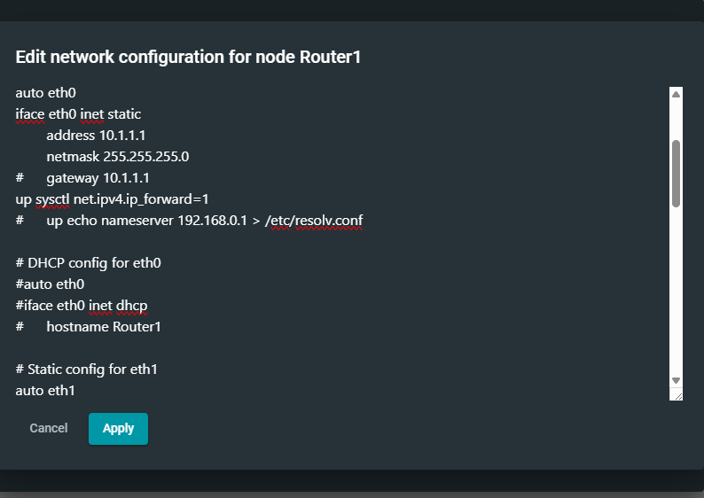

Figure 4: Router1 eth0 interface configured for the 10.1.1.0/24 subnet

The second interface, eth1, was setup as follows.

auto eth1 
iface eth1 inet static 
address 10.1.2.1 
netmask 255.255.255.0

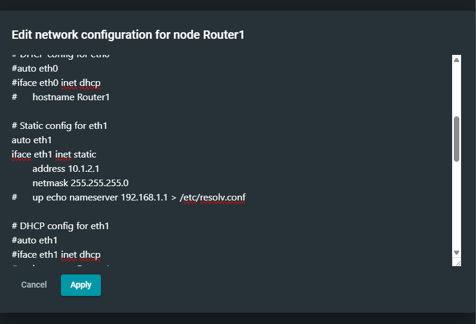

Figure 5: Router1 eth1 interface configured for the 10.1.2.0/24 subnet

Router1 therefore had one interface for each subnet and could route traffic between them.

### Configuring Host3

Host3 was installed on the second subnet and configured as follows:

IP address: 10.1.2.2
Subnet mask: 255.255.255.0
Gateway: 10.1.2.1

The setup utilised was:

auto eth0
iface eth0 inet static
address 10.1.2.2
netmask 255.255.255.0
gateway 10.1.2.1

up sysctl net.ipv4.ip_forward=0

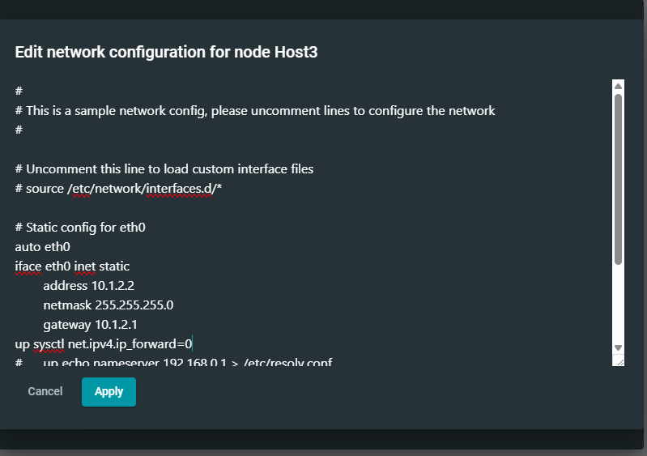

Figure 6: Static IPv4 configuration for Host3

## Verifying IP Addresses and Forwarding

The configuration was verified using the following commands:

Sysctl net.ipv4.ip_forward

and:
ip a

For regular hosts, the output displayed:

net.ipv4.ip_forward=0

This indicates that the device does not forward packets between interfaces.

### Host1 Verification

Host 1 showed:

inet 10.1.1.2/24

and:

net.ipv4.ip_forward=0

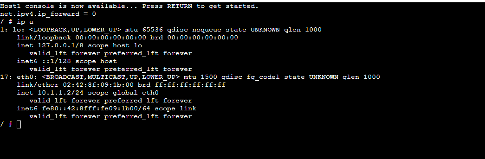

Figure 7: Verification of Host1's IPv4 address and forwarding status

### Host2 Verification

Host2 demonstrated:

inet 10.1.1.3/24

forwarding was disabled.

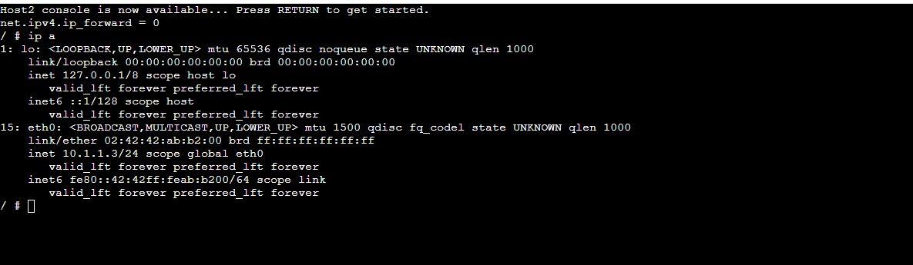

Figure 8: Verification of Host2's IPv4 configuration

### Router1 Verification

Router 1 displayed two configured IPv4 interfaces:

eth0: 10.1.1.1/24
eth1: 10.1.2.1/24

The router also displayed:

net.ipv4.ip_forward=1

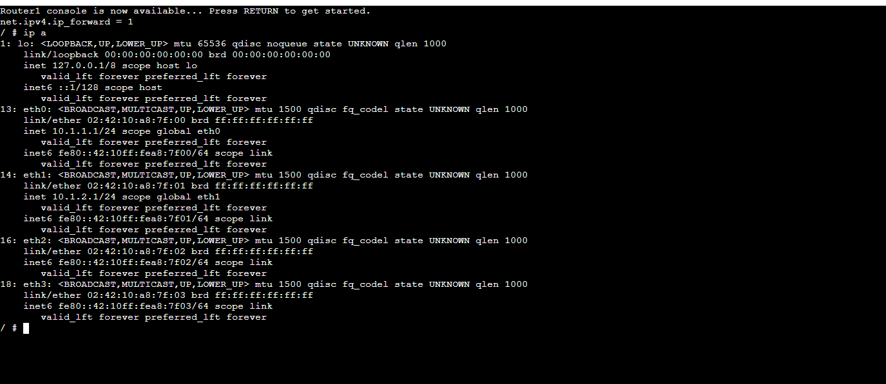

Figure 9: Router1 interfaces and enabled IPv4 forwarding

This configuration is critical because the router must be able to receive an IP packet on one interface and route it through another.

### Host3 Verification

Host3 demonstrated:

inet 10.1.2.2/24

and:

net.ipv4.ip_forward=0

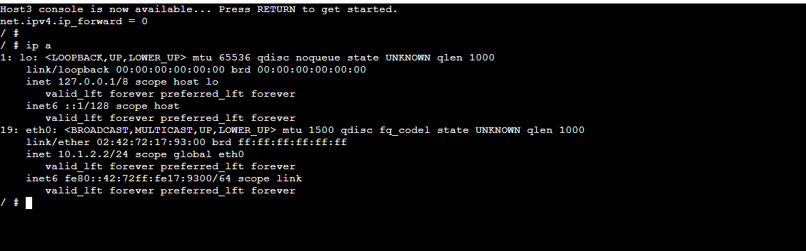

Figure 10: Host3 IP address and forwarding configuration

## Testing Communication Between Different Subnets

After establishing all devices, I tested the connectivity between Host1 and Host3.

The command given was:

ping -c 3 10.1.2.2

The ping succeeded and returned:

Three packets were sent.
Received 3 packets with 0% loss.

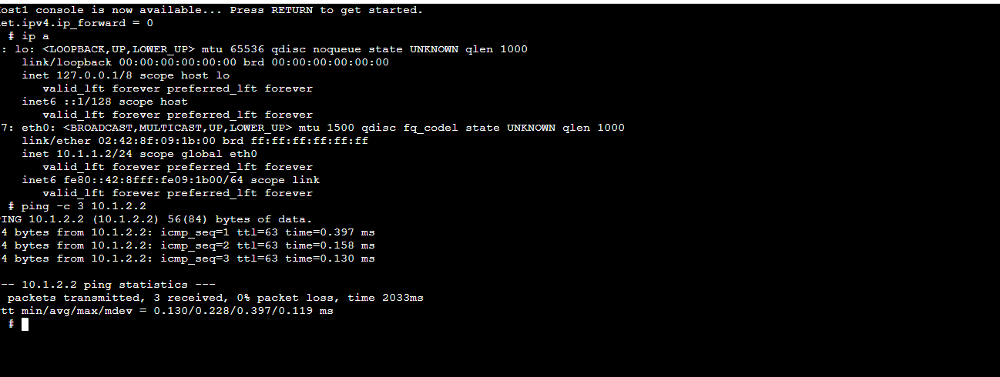

Figure 11: Successful ping from a host on the 10.1.1.0/24 subnet to a host on the 10.1.2.0/24 subnet

This indicated that Router1 had properly redirected traffic across the two networks.

## Viewing the Routing Table

The routing table was shown as follows:

ip route show

On Router1, the routing table had two directly linked networks:

10.1.1.0/24 dev eth0 scope link src 10.1.1.1
10.1.2.0/24 dev eth1 scope link src 10.1.2.1

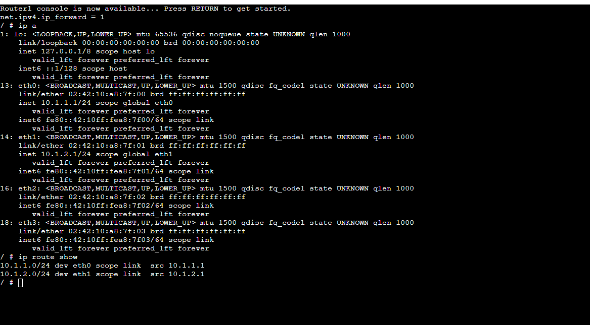

Figure 12: Router1 routing table showing its two directly connected subnets

This demonstrated that Router1 understood that the 10.1.1.0/24 network was available via eth0, whereas 10.1.2.0/24 was accessible via eth1.

## Task 2 – Dynamic Routing with OSPF

### OSPF Network Topology

The second half of the Week 5 practical covered Open Shortest Path First (OSPF) using FRRouting.

The provided network included:

- Host1
- Host2
- FRR-1
- FRR-2
- FRR-3
- FRR-4
- NETem1
- NETem2

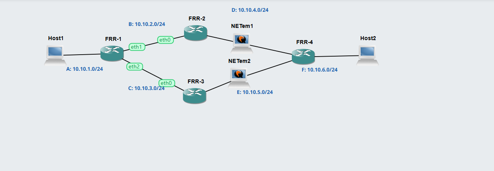

Figure 13: OSPF topology containing four FRR routers and two possible paths between Host1 and Host2

The network included six IPv4 networks:

A: 10.10.1.0/24
B: 10.10.2.0/24
C: 10.10.3.0/24
D: 10.10.4.0/24
E: 10.10.5.0/24 
F: 10.10.6.0/24

There were two potential pathways between Host1 and Host2:

Upper Path:

From Host1 to FRR-1, FRR-2, NETem1, FRR-4, and Host2.

Lower Path:

From Host1 to FRR-1, FRR-3, NETem2, FRR-4, and Host2.

This redundant architecture enabled OSPF to choose a suitable route and immediately switch pathways if a link went unavailable.

## Verifying Host Addresses

### Host1

Host1 was setup as follows:

10.10.1.101/24

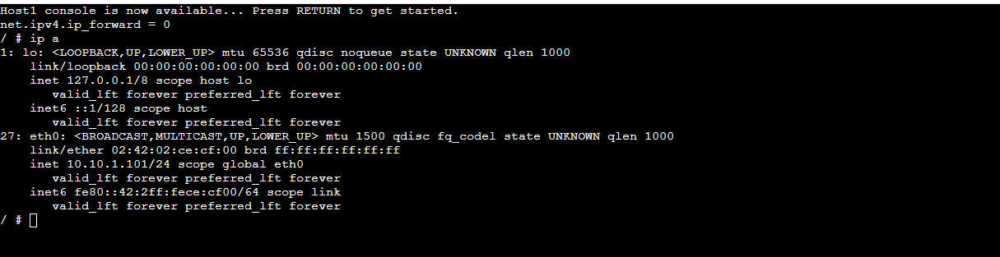

Figure 14: Host1 configured on the 10.10.1.0/24 network

### Host2

Host 2 was configured with:

10.10.6.102/24

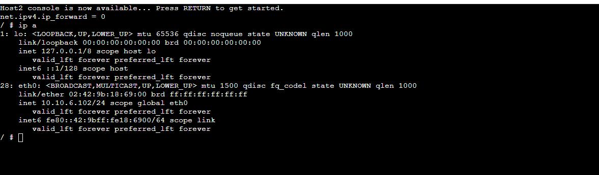

Figure 15: Host2 configured on the 10.10.6.0/24 network\

## Accessing FRRouting

The FRR command-line interface was launched using:

vtysh

The router subsequently displayed:

Hello, this is FRRouting version 8.2.2.

The prompt changed to:

frr#

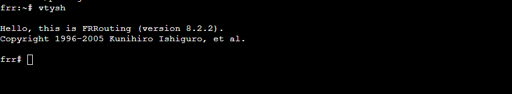

Figure 16: Accessing the FRRouting command-line interface using vtysh

The FRR interface supports routing-specific instructions that differ from regular Linux commands.

The CLI might be exited with:

exit

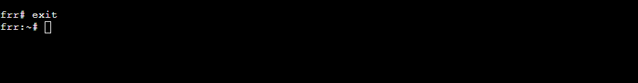

Figure 17: Exiting the FRRouting command-line environment

## Testing End-to-End Connectivity

Before investigating OSPF, I tested communication between Host1 and Host2 using:

ping -c 5 10.10.6.102

The output displayed:

Five packets were sent.
Received 5 packets with 0% loss.

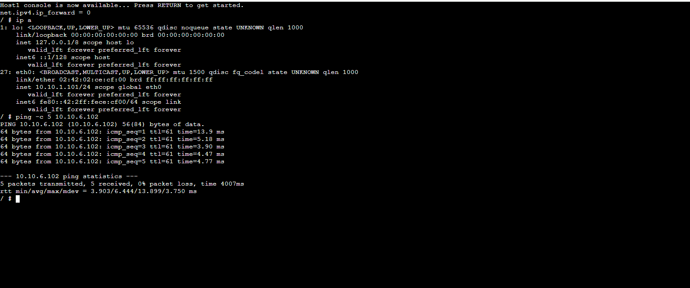

Figure 18: Successful end-to-end ping between Host1 and Host2 through the routed OSPF network

The answers displayed a TTL value of:

ttl=61

This indicates that the packets passed through many routers before reaching their destination.

## Viewing OSPF Neighbours

One of the most significant OSPF instructions utilised was:

show ip ospf neighbor

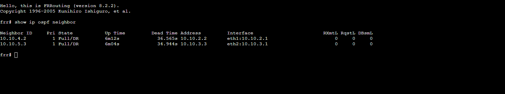

Figure 19: OSPF neighbour information displayed on FRR-1

The result identified two OSPF neighbours.

The neighbour addresses were linked to the two different pathways through:

10.10.2.0/24

and:

10.10.3.0/24

The neighbouring states were shown as:

Full/DR

This indicates that the OSPF neighbour relationships have been effectively formed.

## Viewing the OSPF Routing Table

The OSPF-specific routing table was shown using:

show ip ospf route

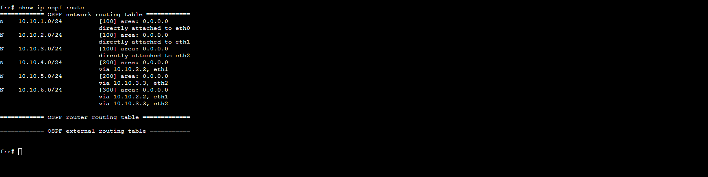

Figure 20: OSPF network routing table on FRR-1

The routing information included both directly linked networks and networks discovered by OSPF.

For example:

10.10.1.0/24
directly attached to eth0
10.10.2.0/24
directly attached to eth1
10.10.3.0/24
directly attached to eth2

For faraway networks, the router showed the next-hop router.

For example:

10.10.4.0/24 through 10.10.2.2, eth1.

and:

10.10.5.0/24 via 10.10.3.3 and eth2.

The destination network 10.10.6.0/24 has routes on both accessible pathways.

This showed how OSPF dynamically learnt networks that were not directly linked.

## Viewing the Complete FRR Routing Table

The command:

show ip route

was used to display the whole routing table.

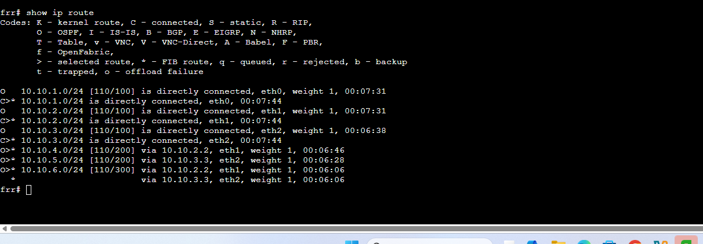

Figure 21: Complete FRR routing table

The routing table employed several codes to indicate how routes were learnt.

For example:

C = Connected 
O = OSPF.

Connected networks displayed as directly connected routes, but distant networks discovered by OSPF were denoted by the letter O.

Examples include:

O>* 10.10.4.0/24 via 10.10.2.2

and:

O>* 10.10.5.0/24 via 10.10.3.3

This demonstrated how FRRouting coupled directly linked routes with dynamically learnt OSPF routes.

## Example OSPF Route Summary

The FRR-1 routing information might be summarised as follows:

| Destination Network | Next Node / Interface       |
| ------------------- | --------------------------- |
| 10.10.1.0/24        | Directly connected via eth0 |
| 10.10.2.0/24        | Directly connected via eth1 |
| 10.10.3.0/24        | Directly connected via eth2 |
| 10.10.4.0/24        | Via 10.10.2.2               |
| 10.10.5.0/24        | Via 10.10.3.3               |
| 10.10.6.0/24        | Via 10.10.2.2 or 10.10.3.3  |

This proved that OSPF could retain many potential routes to a single distant destination.

## Routing Information on Another FRR Router

Another router's routing information was checked as well.

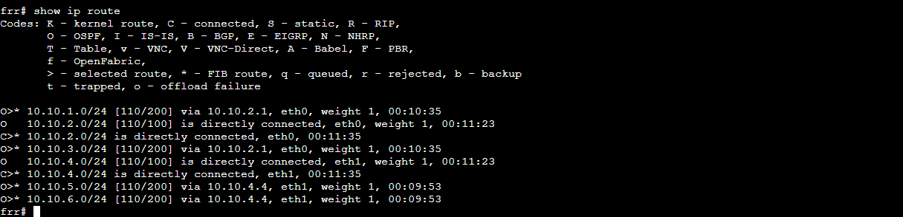

Figure 22: Routing table from another FRR router in the OSPF network

The router linked directly to networks and learnt routes dynamically.

For example, routes to distant places such as:

10.10.1.0/24
10.10.3.0/24
10.10.5.0/24
10.10.6.0/24

were taught via OSPF.

## Comparing show ip route and show ip ospf route

Both instructions were used during the activity:

show ip route

and:

show ip ospf route

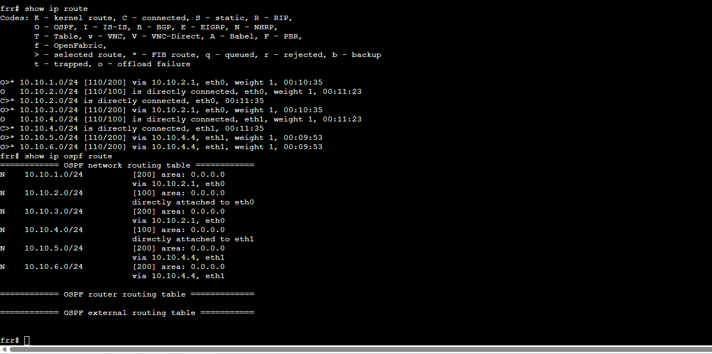

Figure 23: Comparison between the full routing table and the OSPF-specific routing information

show ip route presented the router's current routes, which included both connected and OSPF routes.

show ip ospf route focuses on the routing information stored by OSPF.

## Using Traceroute to Identify the Network Path

The command is:

traceroute 10.10.6.102.

was utilised from Host1 to identify the routers that packets went through before reaching Host2.

The original output displayed the path:

10.10.1.1
10.10.2.2
10.10.4.4
10.10.6.102

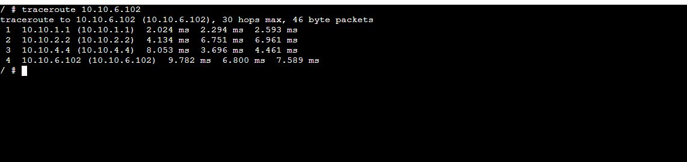

Figure 24: Initial traceroute showing the upper OSPF path from Host1 to Host2

As a result, the original path was approximately:

Host1 
↓ 
FRR-1
↓ 
FRR-2 
↓ 
FRR-4 
↓ 
Host 2

The traceroute also revealed round-trip times for each hop.

## OSPF Path Change After a Link Failure

One of the primary benefits of dynamic routing is the ability to respond automatically when the network topology changes.

After the presently utilised path was halted by halting the associated NETem node, traceroute was restarted.

The initial traceroute showed:

10.10.1.1
10.10.2.2
10.10.4.4
10.10.6.102

After the path became unavailable, the updated traceroute indicated:

10.10.1.1
10.10.3.3
10.10.5.4
10.10.6.102

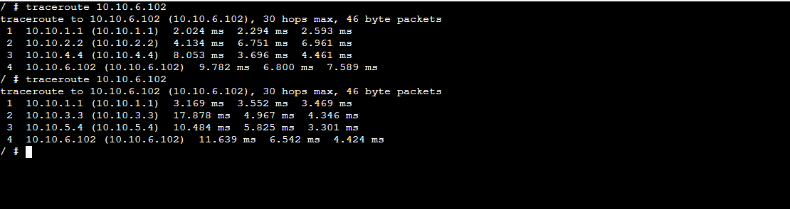

Figure 25: Traceroute results before and after the original OSPF path became unavailable

Thus, the routing path changed from:

From Host1 to FRR-1, FRR-2, FRR-4, and Host2.

to:

From Host1 to FRR-1, FRR-3, FRR-4, and finally Host2.

This demonstrates OSPF convergence. When one path became unavailable, OSPF recalculated the routes and chose another accessible way.

For this path update, Host1 did not require a manual static route addition.

## Important Commands Used

### Checking IPv4 forwarding

sysctl net.ipv4.ip_forward

Shows whether IPv4 packet forwarding is enabled.

### Enabling IPv4 forwarding

sysctl net.ipv4.ip_forward=1.

Enables a Linux device to forward IPv4 packets and function as a router.

### Disabling IPv4 forwarding

sysctl net.ipv4.ip_forward = 0.

Blocks an end host from forwarding packets.

### Viewing IPv4 addresses

ip a

Shows network interfaces and their corresponding IP addresses.

### Viewing the Linux routing table

ip route show

Displays the Linux kernel's current routes.

### Testing network connectivity

ping -c 3 10.1.2.2

Tests communication between two subnets.

### Opening the FRRouting CLI

vtysh

Allows access to FRRouting commands.

### Viewing OSPF neighbours

show ip ospf neighbor

Displays routers that have formed an OSPF neighbour connection.

### Viewing OSPF routes

show ip ospf route

The OSPF routing mechanism maintains routes, which are shown.

### Viewing the complete FRR routing table

show ip route

Displays the connected, OSPF, and other accessible routes.

### Tracing the path to a destination

traceroute 10.10.6.102

Displays each router or hop that packets traverse before reaching the destination.

## Static Routing Concepts vs Dynamic Routing Concepts

| Feature                  | Task 1                   | Task 2                   |
| ------------------------ | ------------------------ | ------------------------ |
| Network type             | Two-subnet network       | Multi-router network     |
| Routing method           | Direct/default routing   | Dynamic OSPF routing     |
| Router software          | Linux routing            | FRRouting                |
| Forwarding               | Manually enabled         | Performed by FRR routers |
| Route inspection         | `ip route show`          | `show ip route`          |
| Dynamic route inspection | Not used                 | `show ip ospf route`     |
| Neighbour discovery      | Not used                 | `show ip ospf neighbor`  |
| Path testing             | `ping`                   | `ping` and `traceroute`  |
| Automatic path recovery  | No redundant path tested | Yes                      |

## What I Learned

During the Week 5 practical, I learnt how:
- Create numerous IPv4 subnets in GNS3
- Configure hosts using static IPv4 addresses
- Configure the default gateways on Linux systems
- Configure a Linux device for multiple interfaces
- Understand how a router links several IP networks
- Configure IPv4 forwarding on a Linux router
- Disable forwarding on the typical end hosts
- To view a Linux routing table, use the ip route display command
- Understand the directly associated routes
- Use ping to test communication across distinct subnets
- Know the difference between a host and a router
- Understand the function of a default gateway
- Use the FRRouting and vtysh commands
- Understand the fundamental function of OSPF
- View the OSPF neighbour relationships
- View the OSPF-learned routes
- Routing tables include information about the next hop
- Identify related routes from OSPF routes
- Use traceroute to identify the exact path that packets traverse
- Understand that a network may have several alternative pathways
- Examine how OSPF automatically adjusts routes when a network connection goes unavailable
- Understand the principles of routing convergence and network redundancy

## Conclusion

The Week 5 practical gave participants hands-on experience with both fundamental IP routing and dynamic routing.

The first job was connecting two IPv4 subnets using a Linux router. Static IP addresses and default gateways were set up, IPv4 forwarding was enabled on Router 1, and connectivity between hosts on various networks was successfully confirmed. The routing table illustrated how directly connected networks were linked to the router's unique interfaces.

The second task involved examining a bigger redundant network utilising OSPF and FRRouting. FRR commands like show ip ospf neighbour, show ip ospf route, and show ip route were used to look at neighbour relationships and dynamically learnt routes.

Finally, traceroute illustrated one of the key benefits of dynamic routing. Initially, traffic followed the higher route via FRR-2. When that path became unavailable, OSPF recalculated the network and rerouted traffic via FRR-3. This showed how dynamic routing methods enhance network resilience by automatically responding to topology changes.

Link to week5.md file: https://github.com/Sumnima-12322151/12322151-COIT20261/blob/main/week5.md
